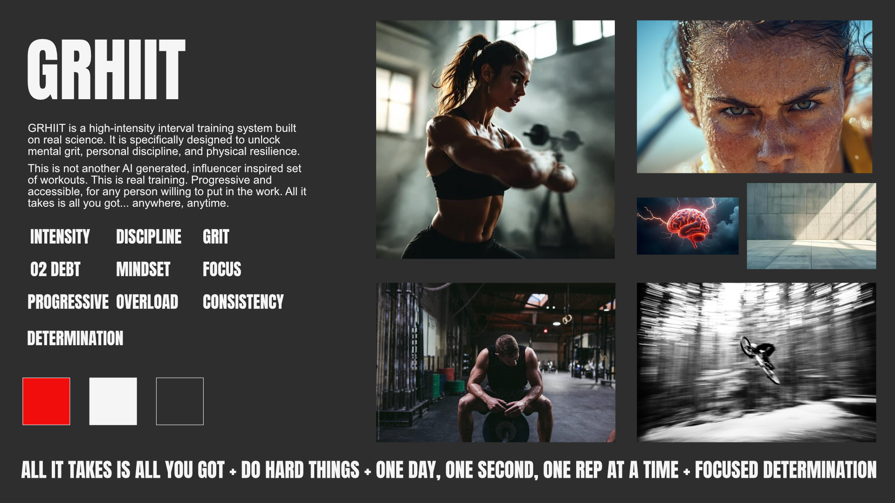

# GRHIIT - Grit High-Intensity Interval Training



**GRHIIT (Grit High-Intensity Interval Training)** is a training system built on real HIIT protocols—not trends. It uses **time-based**, **bodyweight-only** intervals to push you into real oxygen debt, safely and progressively. No equipment. No fluff. **Intensity, discipline, consistency**—anywhere, anytime.

> **All it takes is all you've got.**

## 🎯 Purpose & Mission

GRHIIT is **Kevin Jordan's escape-velocity project**—a way to help people build **mental grit, personal discipline, and physical resilience** using the simplest tools possible: their body and a timer.

### What GRHIIT Is
- A structured HIIT method refined over decades of coaching
- Built around short, brutal intervals (20:10 / 6:3 / 60:20) with **progressive overload**
- **Bodyweight-only** movements for safety, speed, and universal accessibility
- Laser-focused on **mental toughness** and **repeatable effort**, not gimmicks

### What GRHIIT Is Not
- It's not an AI-assembled, influencer routine
- It's not equipment-dependent or space-dependent
- It's not random "sweat for the sake of sweat." Every interval has intent

## 🏋️ Core Principles

- **Intensity** over duration
- **Discipline** over motivation  
- **Consistency** over perfection
- **Progressive overload** over novelty
- **Safety** over ego

## 💪 Who It's For

- Busy professionals who need **high return** in **low time**
- Ex-athletes craving a **real edge** without a barbell
- Beginners who want **simple, safe progression**
- Anyone who wants to **do hard things on purpose**

## 🛠️ Tech Stack

This website is built with modern web technologies for performance and scalability:

- **Framework**: [Nuxt 4](https://nuxt.com/) with TypeScript
- **Styling**: [Tailwind CSS 4](https://tailwindcss.com/)
- **UI Components**: [Headless UI](https://headlessui.com/) for Vue
- **Content Management**: [Nuxt Content](https://content.nuxt.com/)
- **Typography**: Google Fonts (Anton + Inter)
- **Deployment Ready**: Static generation support

### Key Features
- 🎨 **Brand-first design** with custom component library
- 📱 **Fully responsive** mobile-optimized experience
- ♿ **Accessible** UI components with focus management
- 📝 **Content management** system for articles and program updates
- 📧 **Waitlist capture** system ready for backend integration
- ⚡ **Performance optimized** with Nuxt 4's latest features

## 🚀 Development Setup

### Prerequisites
- Node.js 18+ 
- npm, pnpm, yarn, or bun

### Installation

```bash
# Clone the repository
git clone https://github.com/kdjordan/grhiit.git
cd grhiit

# Install dependencies
npm install

# Start development server
npm run dev
```

The development server will start at `http://localhost:3001`

### Available Scripts

```bash
# Development
npm run dev          # Start dev server
npm run build        # Build for production  
npm run preview      # Preview production build
npm run generate     # Generate static site
```

## 📁 Project Structure

```
grhiit/
├── app/                    # Nuxt 4 app directory
│   ├── layouts/           # Layout components
│   ├── pages/             # Route pages
│   └── app.vue            # Root app component
├── components/
│   └── ui/                # Custom GRHIIT UI components
├── content/               # Markdown content
│   ├── articles/          # Training articles
│   ├── blog/              # Blog posts
│   └── pages/             # Static pages
├── assets/                # CSS and static assets
└── public/                # Public static files
```

## 🎨 Brand Identity

GRHIIT's visual identity reflects the intensity and focus of the training method:

- **Colors**: Bold red (`#F20D0D`), deep black (`#202124`), clean whites
- **Typography**: Anton (display), Inter (body) for maximum impact and readability
- **Aesthetic**: High-contrast, minimal, powerful—like the workouts themselves

## 📖 Content Management

Articles, blog posts, and program information are managed through Nuxt Content with structured schemas:

- **Articles**: Training methodology and technique guides
- **Blog**: Program updates, success stories, and community content  
- **Pages**: Static content like About and Program overview

## 🚀 Deployment

The site is optimized for static deployment on platforms like:

- **Vercel** (recommended)
- **Netlify** 
- **GitHub Pages**
- Any static hosting provider

```bash
# Generate static site
npm run generate

# Build output will be in .output/public/
```

## 🤝 Contributing

This is a founder-led project focused on delivering Kevin Jordan's specific vision for GRHIIT. The codebase emphasizes:

- **TypeScript** for type safety
- **Component reusability** with consistent styling
- **Accessibility** best practices
- **Performance optimization**

## 📧 Contact

For questions about GRHIIT training methodology or business inquiries, reach out through the website's waitlist system.

---

**Built with intensity. Powered by discipline. Driven by grit.**

*Do hard things. On purpose.*