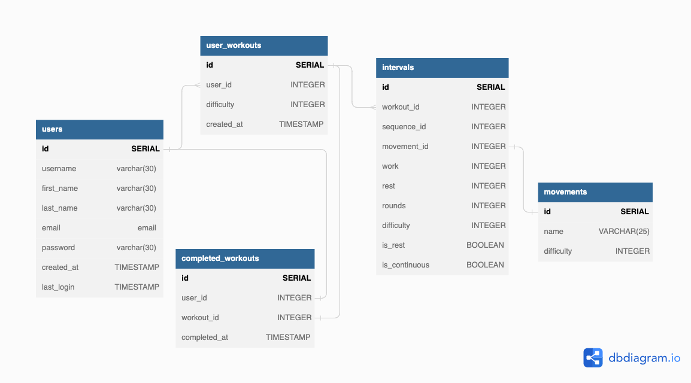
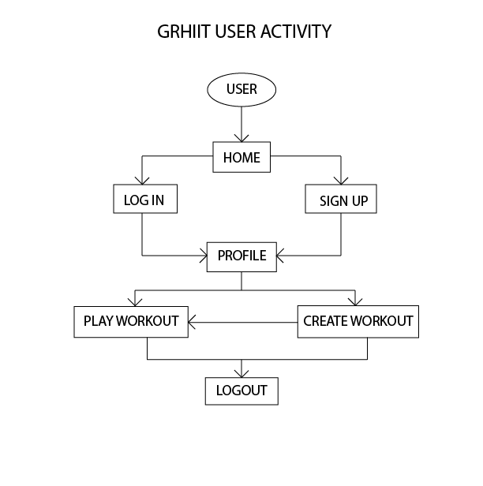

## PROJECT PROPOSAL - GRHIIT  
&nbsp;
### CONCEPT
This is a portion of a larger project and based on an idea that I've had for a few years. The full application will be an introduction to a specific type of fitness training that I have personally been involved in for over a decade. The function of the complete app will be to introduce the principles behind the training methodology and give the user a 10 workout cycle to complete. 

### TIMELINE
*coming soon*

### STACK
The tech stack will be React on the frontend. The API will be built using NodeJS and the DB will be Postgres. All components of the app will be hosted on AWS.  

### GOALS
This project will flush out v0.5 of this app. I will be focusing on the Interval Training builder functionality, which in essence will serve as the admin section for me to create the training sesssions. This is the guts of the application in reality and I have chosen to implement this portion of the app for the capstone project.  
When complete, a user will be able to register themselves and create workouts. They will also be able to 'play' a workout that they have built. 'Playing' a workout means pressing a start button and having the app go through the intervals in order, including dedicated rest periods of no activity. While the workout is being 'played' the screen will show progress through the workout as well as instruct the user when to 'Work' and when to 'REST'. Each workout will have a difficulty score based on the movement, the number of rounds and the work/rest ratio of the intervals it contains.

### FUNCTIONALITY
This basic functionality will include :
- ability for a user to register into the app
- the user will then be able to create a workout
- workouts consist of intervals 
- intervals consist of : a movement, a work interval, and a rest interval, and a number of rounds
- workouts can also have dedicated rest intervals, which will occur between intervals
- the owner of the workout will then be able to 'play' the workout, which progresses through the intervals with a stopwath type function, cuing the athlete to 'work' and 'rest' within each interval - showing the movement on the screen as well.

### ERD

The basic realatiohships are realted in the diagram above. What we are describing here are the following :

- A **user** can have *many* workouts.  
- A **workout** consists of *many* intervals.
- **Intervals** are what the user participates in to complete a workout. An interval is comprised of : a *movement*, a *work* period, and a *rest* period preformed for a number of *rounds*. Each interval has a difficulty score associated with as well calculated by the difficulty of the movement combined with the difficulty of the work/rest ratio. In general, longer work periods followed by shorter rest periods makes an ratio more difficult.
- **Movements** are stored and have a *name* and a difficulty on a scale of 1-10, with 10 beign the most diffcult

### ACTIVITY

When a user visits the landing page they will presented with a 'sign in' or 'log in' form. Once they either sign up or register, they are pushed to their profile page. For this version, this will display all of the workouts that they have built and allow them to select and 'play' a workout. Also, they will be able to select 'create workout', which will send them to the interval builder interface. From here they can save that workout and elect to 'play' it or to go back to the profile page and select another workout. 

### API
**coming soon**

### UI MOCKS
**coming soon**

