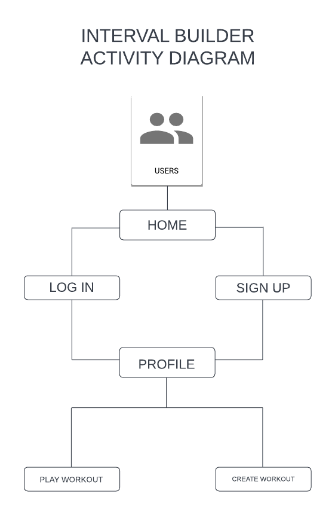
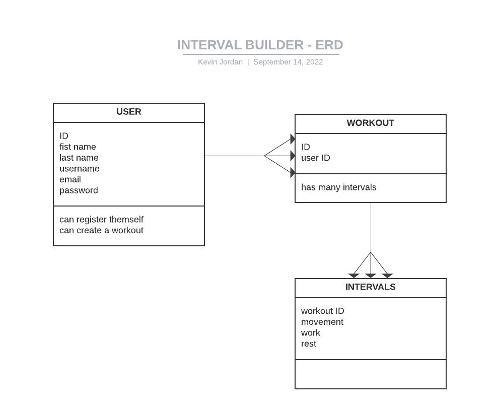
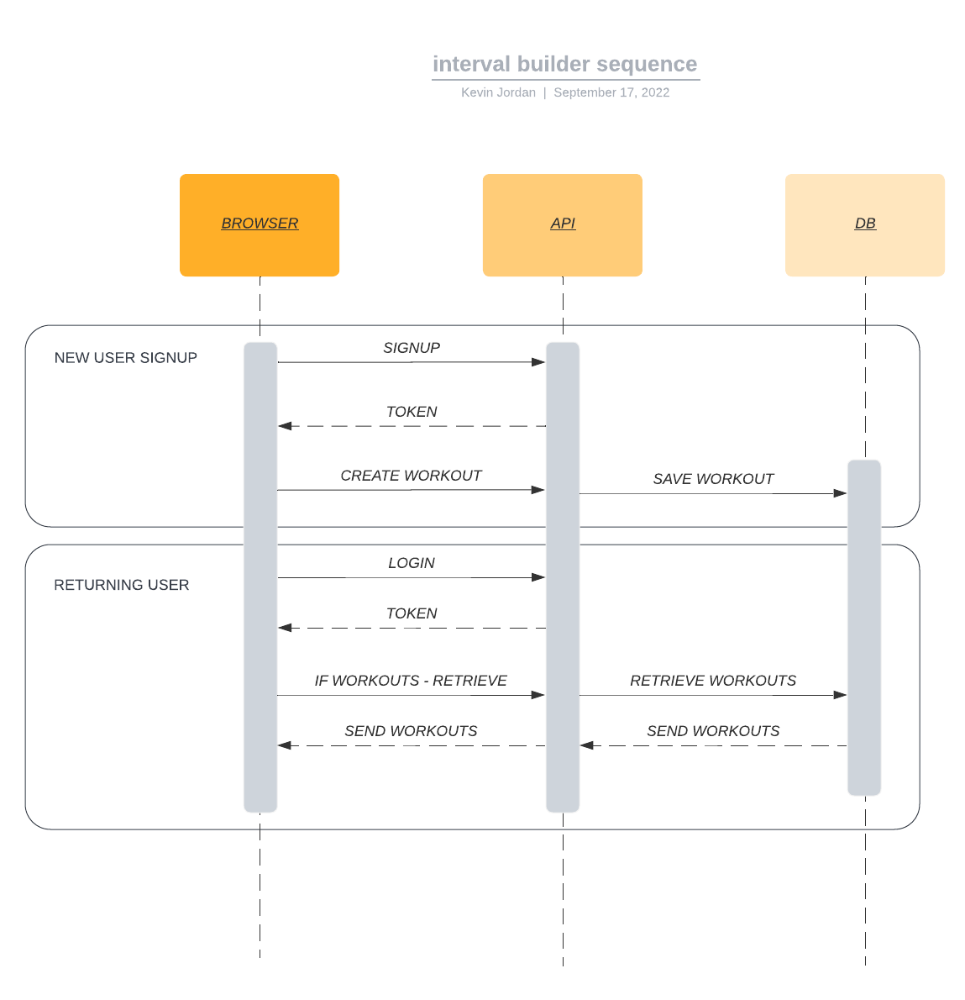

# PROJECT PROPOSAL - GRHIIT

### CONCEPT
This is a portion of a larger project and based on an idea that I've had for a few years. The full application will be an introduction to a specific type of fitness training that I have personally been involved in for over a decade. The fucntion of the complete app will be to introduce the principles behind the training methodology and give the user a 10 workout cycle to complete. 

### STACK
The tech stack will be React on the frontend. The API will be built using NodeJS and the DB will be Postgres. All components of the app will be hosted on AWS.  

### GOALS
This project will flush out v0.5 of this app. I will be focusing on the Interval Training builder functionality, which in essence will serve as the admin section for me to create the training sesssions. This is the guts of the application in reality and I have chosen to implement this portion of the app for the capstone project.

### FUNCTIONALITY
This basic functionality will include :
- ability for a user to register into the app
- the user will then be able to create a workout
- workouts consist of intervals 
- intervals consist of : a movement, a work interval, and a rest interval
- workouts can also have dedicated rest intervals, which will occur between intervals
- the owner of the workout will then be able to 'play' the workout, which progresses through the intervals with a stopwath type function, cuing the athlete to 'work' and 'rest' within each interval - showing the movement on the screen as well.

## DIAGRAMS
&nbsp;
&nbsp;

&nbsp;
&nbsp;

&nbsp;
&nbsp;

